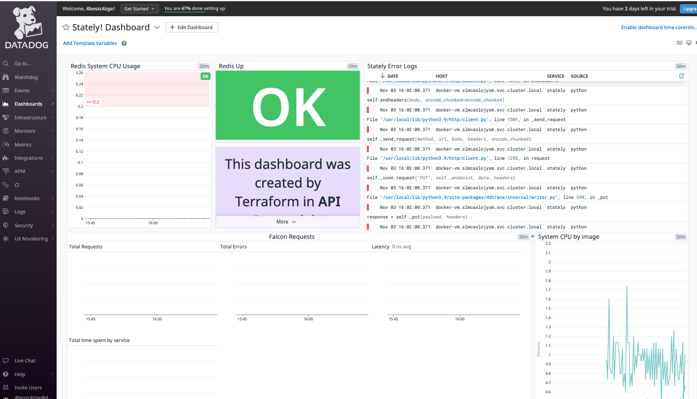
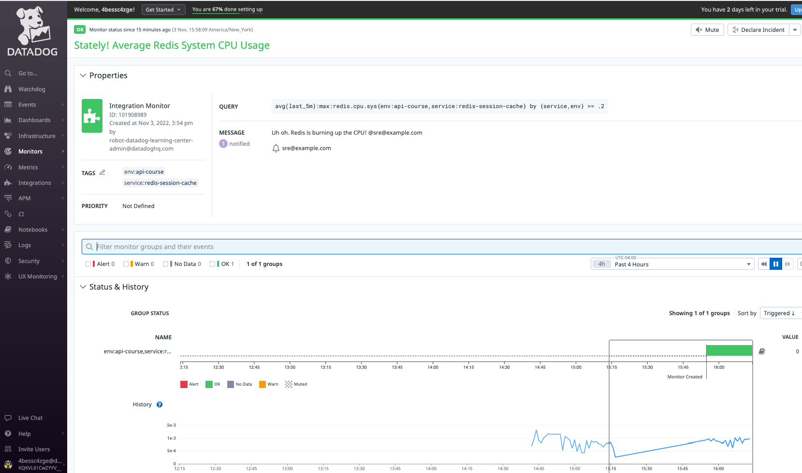

# Terraform

* Terraform configurations that create a Datadog monitor and dashboard while provisioning an application

* how managing Datadog resources with IaC techniques can ensure consistency and immutability

## Terraform configuration
Three Terraform files provision this application.

`variables.tf` brings your API and Application keys into scope from the environment.

`main.tf` defines and configures the Datadog agent, Redis service, and Python application Docker containers. It's similar to the `docker-compose.yml`. All of the Datadog container labels and environment variables are configured here.

`datadog.tf` creates a Datadog monitor and a dashboard for the application.

`datadog.tf` defines two resources:

* A datadog_monitor that watches redis.cpu.sys
* A dashboard containing 5 widgets

The `datadog_monitor` resource configuration closely matches the Monitors > New Monitor configuration in the Datadog app.

Each of the widget blocks follows the Datadog API schema for its type. Each is accompanied by a `widget_layout` block defining its place on the dashboard.

Take a closer look at the `alert_graph` widget in the `datadog_dashboard` resource configuration. The `alert_id` value is `${datadog_monitor.redis_cpu.id}`, which references the id of the `datadog_monitor`. This id will become available after Terraform creates it, and the dashboard will be able to display it as an alert graph.

## Run Terraform
In the terminal, run the following command so Terraform can download the Docker and Datadog providers declared at the top of `main.tf`
```
terraform init
```

Now, run the following command to get Stately! and the Datadog dashboard up and running:
```
terraform apply --auto-approve
```
You should see a couple of pages of output from Terraform as it provisions Stately!, concluding with Apply complete! ...:

Take a look at the Datadog app and find Stately! Average Redis System CPU Usage under Monitors > Manage Monitors. Then find Stately! Dashboard under Dashboards > Dashboard List.

Your newly created dashboard should look something like this:




## Immutability

If you make any changes to the dashboard, they will disappear when the dashboard reverts to its originally configured state.

### Conclusion

Terraform's local-exec Provisioner allows you to run commands on the provisioning host, opening up all of Datadog's API capabilities.
---
References:

* https://registry.terraform.io/providers/DataDog/datadog/latest/docs

* https://developer.hashicorp.com/terraform/language/resources/provisioners/local-exec

* https://docs.datadoghq.com/developers/community/libraries/

* https://docs.datadoghq.com/api/latest/using-the-api/

* https://docs.datadoghq.com/dashboards/widgets/
